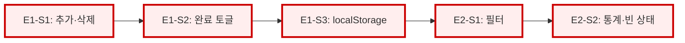

# 의존성 그래프: 로컬 저장 Todo 관리 웹앱

메인 계획: [plan-todo-app.md](plan-todo-app.md)

## Story 간 의존성

### 범례
- 🔴 빨간 테두리: 크리티컬 패스 (지연 허용 없음) — 이 예제는 모든 Story 가 선형 크리티컬
- 실선 화살표: 하드 블로킹 (A 없이 B 불가)

## 병렬화 트랙

예제 규모가 작고 파일이 겹쳐 병렬화 여지가 없다 — 단일 트랙. 실제 프로덕션 규모 프로젝트에서는 backend/frontend/data 를 트랙 분리한다.

## 마일스톤별 완료 Story

- **M1 (day 1)**: E1-S1, E1-S2, E1-S3
- **M2 (day 2)**: E2-S1, E2-S2

## 외부 의존성

없음. npm 패키지 외의 외부 서비스·인프라·법무 검토 없음.
