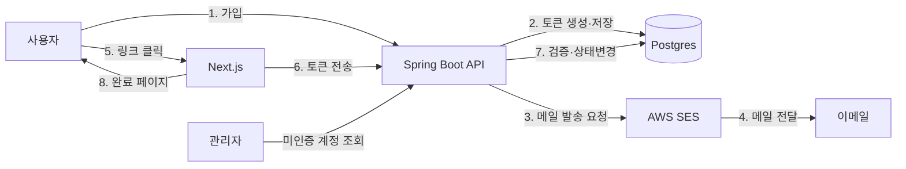

# 아키텍처: 사용자 이메일 인증

- **작성일**: 2026-04-20
- **참조 PRD**: docs/prd/prd-email-verification.md
- **상태**: approved

## 1. 개요

Spring Boot 기반 백엔드 + Next.js 프론트엔드로 구성된 기존 SaaS에 이메일 인증 모듈을 추가한다. 새 마이크로서비스는 만들지 않고 기존 `auth` 도메인에 기능을 확장한다.

## 2. 기술 스택

| 영역 | 선택 | 선택 이유 |
|------|------|-----------|
| 백엔드 | Spring Boot 3.x / Java 21 | 기존 스택 일치 |
| DB | PostgreSQL 16 | 기존 DB 활용 |
| 이메일 발송 | AWS SES | 기존 알림 발송 이미 SES 사용 중 |
| 프론트엔드 | Next.js 15 (App Router) | 기존 어드민·사용자 UI 모두 Next.js |
| 인증 | 기존 JWT 기반 유지 | 변경 없음 |
| Rate limit | Bucket4j + Redis | 기존 API rate limiter 재사용 |

## 3. 시스템 구조



## 4. 데이터 모델

### 신규 테이블: `email_verification_tokens`

```sql
CREATE TABLE email_verification_tokens (
    id          BIGSERIAL PRIMARY KEY,
    user_id     BIGINT NOT NULL,
    token_hash  TEXT NOT NULL,
    expires_at  TIMESTAMPTZ NOT NULL,
    used_at     TIMESTAMPTZ,
    created_at  TIMESTAMPTZ NOT NULL DEFAULT NOW(),
    
    CONSTRAINT fk_evt_users FOREIGN KEY (user_id) REFERENCES users(id) ON DELETE CASCADE
);

CREATE UNIQUE INDEX uq_evt_token_hash ON email_verification_tokens(token_hash);
CREATE INDEX idx_evt_user_id_created ON email_verification_tokens(user_id, created_at DESC);
CREATE INDEX idx_evt_expires_unused ON email_verification_tokens(expires_at) WHERE used_at IS NULL;
```

- **`token_hash`**: 원본 토큰은 메일로 발송, DB에는 SHA-256 해시만 저장 (DB 유출 시 영향 최소화)
- **`used_at`**: 단회용 보장

### 기존 테이블 변경: `users`

```sql
ALTER TABLE users ADD COLUMN email_verified_at TIMESTAMPTZ;
CREATE INDEX idx_users_unverified ON users(created_at) WHERE email_verified_at IS NULL;
```

- `email_verified_at IS NULL` ⇒ 미인증 상태

## 5. API 설계

### POST /api/v1/auth/verification/send
재전송 요청. Rate limit: IP당 분 1회, 시간당 5회.

```json
요청: { "email": "user@example.com" }
응답 200: { "message": "Sent", "nextAllowedAt": "2026-04-20T10:15:00Z" }
응답 429: RFC 7807 Problem Details + Retry-After 헤더
```

### POST /api/v1/auth/verification/verify
토큰 검증 및 인증 처리.

```json
요청: { "token": "raw-token-from-email" }
응답 200: { "userId": 1234, "verifiedAt": "..." }
응답 404: 토큰 없음 / 만료 / 이미 사용
```

### GET /api/v1/admin/users/unverified
관리자 전용. 7일 이상 미인증 계정 목록.

```
쿼리: ?page=1&limit=50&olderThanDays=7
응답: { "items": [...], "nextCursor": "..." }
```

## 6. 프론트엔드 구조

```
app/
├── (auth)/
│   ├── verify-email/
│   │   ├── page.tsx              # /verify-email?token=xxx
│   │   ├── expired/page.tsx      # /verify-email/expired
│   │   └── success/page.tsx
│   └── signup/
│       └── page.tsx              # 인증 메일 재전송 버튼 포함
└── (admin)/
    └── dashboard/
        └── unverified-accounts/
            └── page.tsx
```

- Server Action으로 토큰 검증 호출
- 재전송은 Rate limit 메시지와 남은 시간 표시

## 7. 보안

- 토큰 원본은 URL 쿼리에만 노출, DB엔 해시만
- 토큰 길이 43자 (base64url로 32바이트)
- `java.security.SecureRandom` 사용
- 만료 24시간 (PRD FR-3)
- CSRF: Server Action이 Origin 검증 + SameSite=Lax
- 로그에 토큰 원본 기록 금지 (해시 prefix 6자까지만)

## 8. 성능 고려

- 메일 발송은 **비동기** (Spring `@Async` + 스레드풀 분리)
- 토큰 검증은 단일 인덱스 조회 — O(log n)
- 만료 토큰 정리는 배치 잡 (매일 새벽, `WHERE expires_at < NOW() AND used_at IS NULL`)

## 9. 관찰성

- 메트릭:
  - `email_verification_sent_total` (counter, labels: result=success|failed)
  - `email_verification_completed_total` (counter)
  - `email_verification_duration_seconds` (histogram, 가입 → 인증 완료 소요)
- 로그:
  - 메일 발송 요청 (userId, 결과)
  - 토큰 검증 (userId, success/fail 사유)
- 대시보드: 일별 인증 완료율 (Grafana 판)

## 10. 배포 및 환경변수

새 변수:
- `AWS_SES_REGION`
- `AWS_SES_SENDER_EMAIL`
- `EMAIL_VERIFICATION_URL_BASE` (예: `https://app.example.com/verify-email`)
- `EMAIL_VERIFICATION_TTL_HOURS` (기본 24)

배포 순서:
1. DB 마이그레이션 (새 테이블 + users 컬럼 추가)
2. Backend 배포 (엔드포인트 활성, 발송은 feature flag로 막아둠)
3. Frontend 배포 (신규 페이지 포함)
4. Feature flag 해제 (일부 사용자부터 10% → 50% → 100%)

## 11. 구현 순서 제안

1. DB 스키마 마이그레이션
2. 토큰 생성·해시·검증 핵심 로직
3. SES 메일 발송 통합
4. 가입 플로우 훅 (기존 가입 로직에 이벤트 추가)
5. 재전송 엔드포인트 + Rate limit
6. 프론트 verify-email 페이지
7. 재전송 버튼 UI
8. 관리자 대시보드 페이지
9. 미인증 계정 기능 제한 훅 (결제·작성)
10. 통합 테스트 + 스테이징 배포

## 12. 테스트 전략

- **단위**: 토큰 생성·해시·검증 로직, Rate limit 판단
- **통합**: Testcontainers + MailHog (SES 대체) 로 E2E 검증
- **부하**: 가입 동시 1000명 시 메일 큐 지연 < 30초
- **보안**: 토큰 예측 불가, 재사용 차단, 만료 강제

## 13. 리스크

- **SES 발송 제한(throttling)**: 계정 초기 샌드박스 상태일 수 있음 — 프로덕션 access 신청 선행
- **스팸 분류**: SPF/DKIM/DMARC 설정 미흡 시 스팸함 행 — DNS 변경은 미리
- **기존 미인증 계정 처리**: 배포 시점 기존 가입자 중 미인증 수만 개 — 마이그레이션 시 `email_verified_at = created_at` 백필 또는 별도 정책 결정 필요
