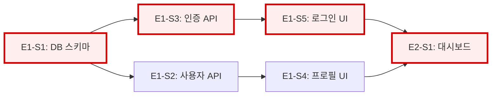
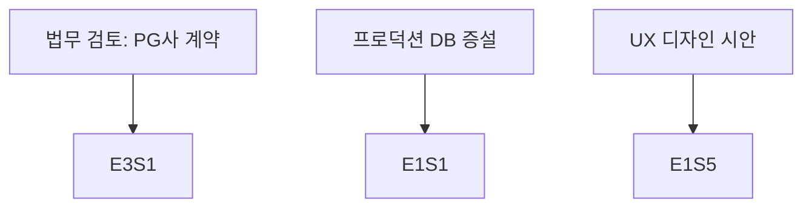

# 의존성 그래프: <제목>

메인 계획: [<Plan 파일명>](<Plan 상대 경로>)

## Story 간 의존성

### 범례
- 🔴 빨간 테두리: 크리티컬 패스 (지연 허용 없음)
- 실선 화살표: 하드 블로킹 (A 없이 B 불가)
- 점선 화살표: 소프트 의존 (Mock 등으로 우회 가능)

## 병렬화 트랙

- 트랙 A (Backend/DB): E1-S1 → E1-S3 → E2-S2 → ...
- 트랙 B (Frontend): E1-S4 → E1-S5 → E2-S1 → ...
- 트랙 C (QA/통합): 각 Story 완료 후 즉시

## 마일스톤별 완료 Story

- **M1 (주 2)**: E1-S1, E1-S2, E1-S3
- **M2 (주 5)**: E1-S4, E1-S5, E2-S1, E2-S2
- **M3 (주 8)**: ...
- **M4 (주 11)**: 잔여 전부 + 버퍼

## 외부 의존성

프로젝트 외부의 의존 (3rd party API, 인프라 준비, 법무 검토 등):

